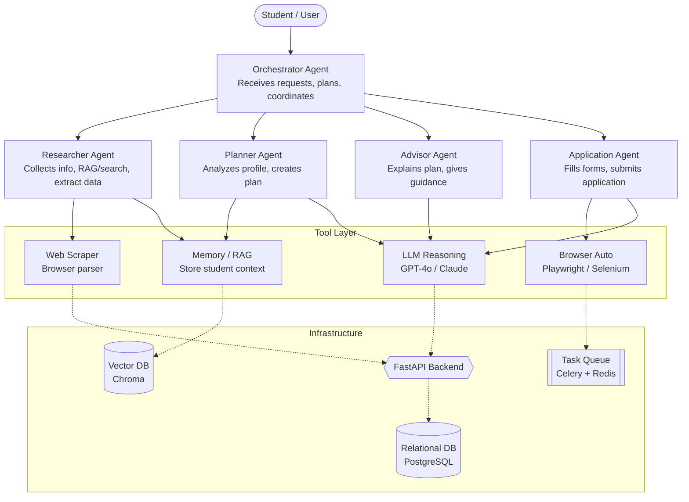

# Student Admission Agents

## Overview
This project is an automated Multi-Agent System (MAS) designed to assist students with the entire university admission process. By leveraging Large Language Models (LLMs) and agentic design patterns, the system automatically gathers admission data, advises students on required documents, and securely executes the registration process using a Human-in-the-Loop approach.

This project is inspired by and utilizes concepts from the [Microsoft AI Agents for Beginners](https://github.com/microsoft/ai-agents-for-beginners) curriculum.

## System Architecture

The architecture relies on a central Orchestrator that delegates tasks to specialized sub-agents. The pipeline is: **Information → Planning → Explanation → Execution**.

## Agent Design & Responsibilities

The system consists of 5 primary agents utilizing distinct AI design patterns:

* **Orchestrator Agent (ReAct Pattern):**
  * Entry point for the user.
  * Analyzes the student's request, formulates a plan, and routes tasks to the appropriate child agents (sequentially or in parallel).

* **Researcher Agent (Tool Use & RAG):**
  * Collects information from external sources (e.g., VnExpress).
  * Queries RAG/search and extracts admission-related data (requirements, deadlines, universities, etc.).
  * **Input:** Article link or query.
  * **Output:** Structured data (requirements, deadlines, universities, etc.).

* **Planner Agent:**
  * Analyzes the student profile and research data.
  * Creates a checklist and registration plan.
  * **Input:** Student profile + research data.
  * **Output:** Admission plan (steps, requirements).

* **Advisor Agent:**
  * Explains the plan to the student in natural language.
  * Provides guidance and helps with decision-making.
  * **Input:** Plan + context.
  * **Output:** Human-readable guidance (chat response).

* **Application Agent (Executor):**
  * Executes actions: fills forms, submits applications, interacts with tools (Playwright, APIs).
  * **Input:** Plan + confirmed data.
  * **Output:** Application status (draft / submitted).

## End-to-End Workflow

1. **Input:** The student provides basic information (name, target scores, university aspirations) in the UI.
2. **Information Gathering:** The *Researcher Agent* collects and extracts relevant admission data from external sources.
3. **Planning:** The *Planner Agent* analyzes the student profile and research data, generating a personalized admission plan and checklist.
4. **Explanation & Guidance:** The *Advisor Agent* explains the plan, provides guidance, and helps the student make informed decisions.
5. **Preparation:** The student prepares their documents (interacting with the *Advisor Agent* for clarifications).
6. **Execution:** The *Application Agent* (Executor) fills out forms and submits the application, pausing for human confirmation if needed.
7. **Monitoring:** The system tracks the application status and notifies the student of the outcome.

## Tech Stack

| Layer | Technology | Justification |
| :--- | :--- | :--- |
| **Agent Framework** | AutoGen / Semantic Kernel | Robust support for multi-agent orchestration and tool invocation. |
| **LLM Engine** | GPT-4o / Claude 3.5 Sonnet | High-level reasoning required for academic advisory and dynamic planning. |
| **Web Interaction** | Playwright / BeautifulSoup | Playwright handles both dynamic scraping and automated form submission. |
| **Memory / RAG** | ChromaDB + sentence-transformers | Lightweight, local execution, ideal for prototyping. |
| **Backend API** | FastAPI | High performance, async support, easy integration with Python agent loops. |
| **Task Queue** | Celery + Redis | Asynchronous handling of long-running tasks (scraping and browser automation). |
| **Database** | PostgreSQL | Persistent storage for user profiles and historical session data. |
| **Frontend** | ReactJS / Streamlit / Gradio | Rapid UI prototyping for chat interfaces and dashboard views. |